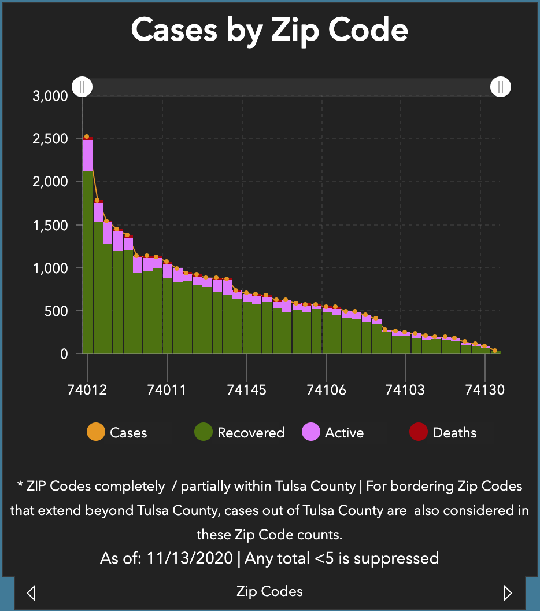
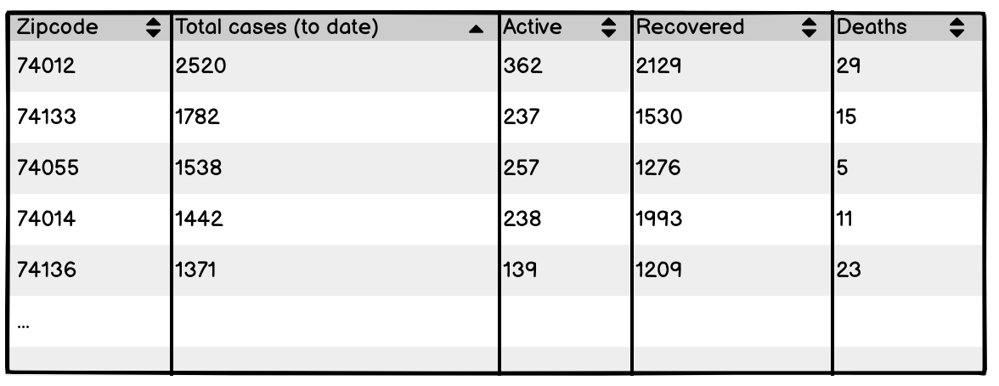
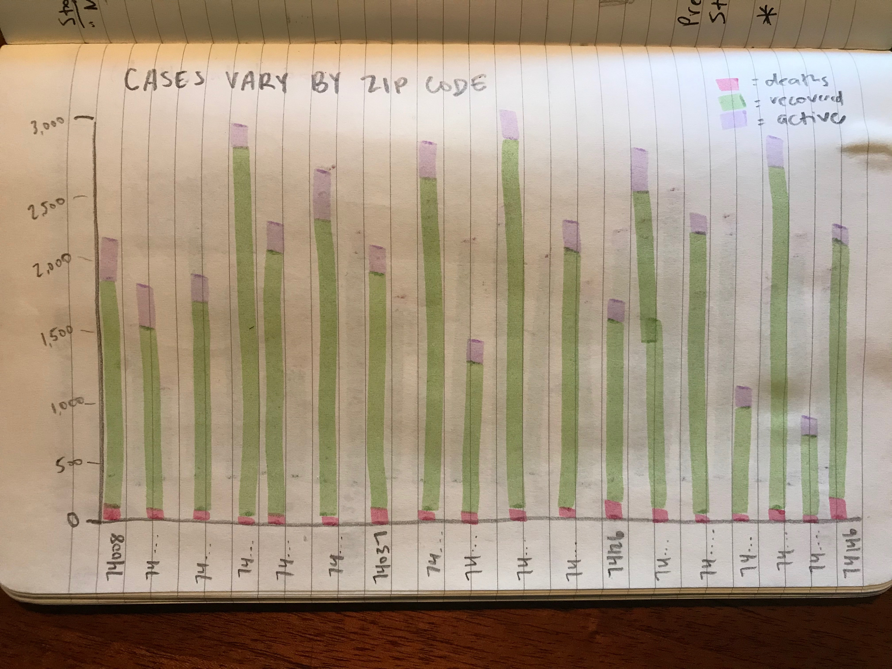
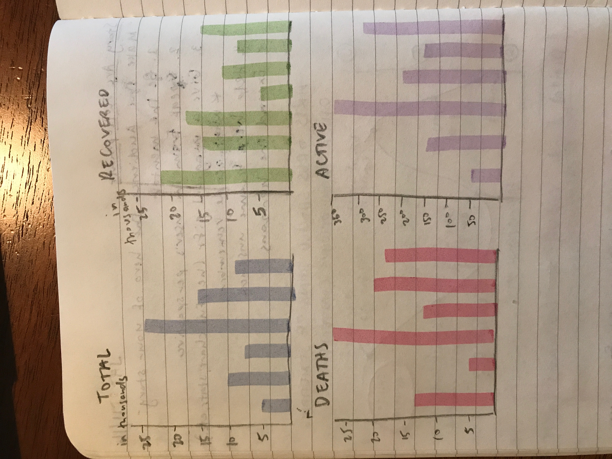

# Critique by design

## Original visualization

Source: [Tulsa Health Department](https://www.tulsa-health.org/coronavirus-disease-2019-covid-19/tulsa-county-covid-19-data)

## Process

### Wireframes
**Sketch 1**

**Sketch 2**

**Sketch 3**

### Summary
After completing the critique, the biggest problems I identified with the original visualization were readability and clarity. I identified the aspects that were contributing to that—bars that were close together, the “trend” line, and x-axis labels—and started brainstorming ways to improve those. While sketching, I thought about the information that was most important to include and if the stacked bar chart was the most effective type of data visualization. Because the original visualization had seemed cluttered, I started by wireframing a table so that I could easily include all the same data. After completing the table, I realized that the visual aspect of the original was important and I did not want to remove viewers’ ability to visually compare case numbers by height and proportion. I sketched two other alternatives: a stacked column chart similar to the original and a grid of column charts. My sketch of the stacked column chart was organized by zip code and had more space between the bars. The grid chart had four smaller charts: one for total Covid cases, deaths, recovered, and active cases.

I showed all three of these options to two other people. Both identified that the table was not engaging. Person 1 thought the grid of charts wireframe was most visually appealing, but identified that having a grid of charts, each showing data for all 42 zip codes, might look cluttered (which it did). Person 2 was unsure about what data the grid of charts was displaying as compared to the original and thought the data displayed on its own wasn’t as impactful as seeing it as a proportion of the total cases. For the stacked bar chart—which I ultimately chose—person 1 suggested a vertical presentation so that it would look less cramped while allowing people to scroll to see all the bars. 

My final redesign is a stacked bar chart. I chose to maintain the same chart type because I saw the purpose of this chart as to compare the number of cases in each zip code and the proportion of each type. Instead of the dotted line going along the tops of the bars, I added values on top of the bars so viewers can easily identify total cases for each zip code. I moved “Deaths” to the bottom of the bar since they are the smallest value and are more visible there. I kept “Active” cases at the top of the bar since that is the most present information. At first, I thought ordering the bars by zip code might be a good way to help people easily find data about their area, but that made the chart look unorganized so I returned to the original, descending order. (There is also a map farther down on the webpage that provides zip code data where people can easily locate their area.) To help people find specific zip codes, I made sure the zip code labels are clear on each bar. Users can also use the key to toggle between seeing just deaths, recovered, or active cases instead of their proportion in the bar. 

## Redesign

