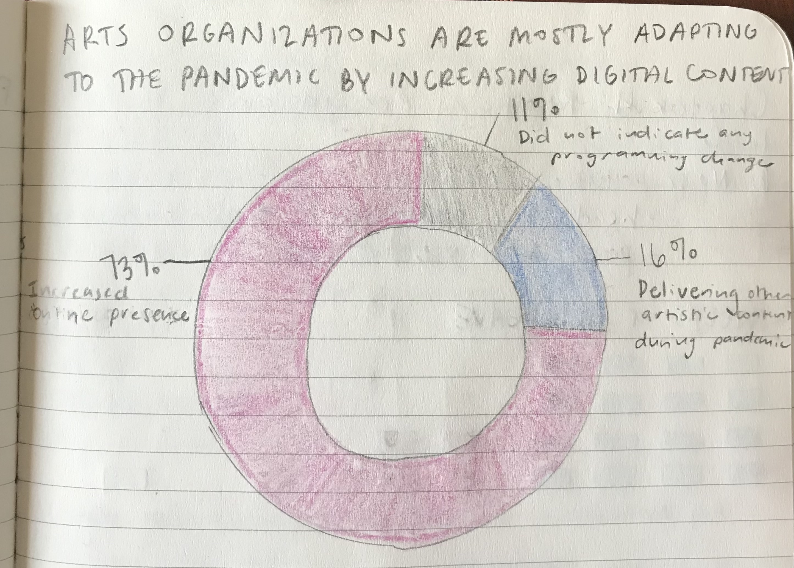
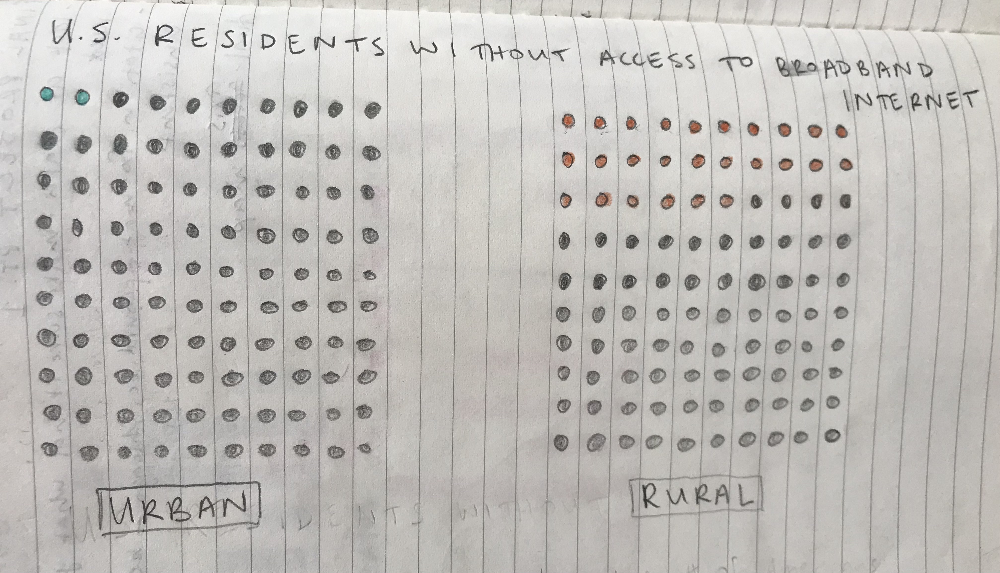
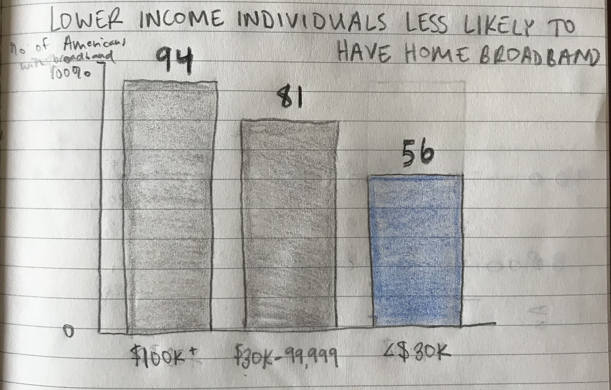

# Summary
In response to the Covid-19 pandemic, many arts organizations have turned to online platforms to continue to provide access to their work while people cannot gather in person. Many have indicated that this generally allows increased access to the organization since ticket prices and physical barriers are limited. Internet access, however, is not as universal as many arts administrators may think. Through my final project, I want to show the digital divide that exists in the United States and how it impacts people’s access to online content, encouraging arts organizations to find alternatives to engage the community as the pandemic continues. 

# Outline
•	Setup: In response to the Covid-19 pandemic, many arts organizations have turned to online content as a way to engage with their patrons when gathering in person is not feasible.

•	Conflict: Because of the digital divide in the United States, not everyone has access to these online resources

<noscript></noscript><object class='tableauViz'  style='display:none;'><param name='host_url' value='https%3A%2F%2Fpublic.tableau.com%2F' /> <param name='embed_code_version' value='3' /> <param name='path' value='shared&#47;ZBPTYNNNW' /> <param name='toolbar' value='yes' /><param name='static_image' value='https:&#47;&#47;public.tableau.com&#47;static&#47;images&#47;ZB&#47;ZBPTYNNNW&#47;1.png' /> <param name='animate_transition' value='yes' /><param name='display_static_image' value='yes' /><param name='display_spinner' value='yes' /><param name='display_overlay' value='yes' /><param name='display_count' value='yes' /><param name='language' value='en' /><param name='filter' value='publish=yes' /></object>
                

•	Resolution: As the pandemic continues, and the arts sector is likely to be one of the last industries to return to in person operations, arts organizations can implement offline alternatives to engagement, such as radio broadcasts and education packet distribution. 

# Data

# Method and medium
