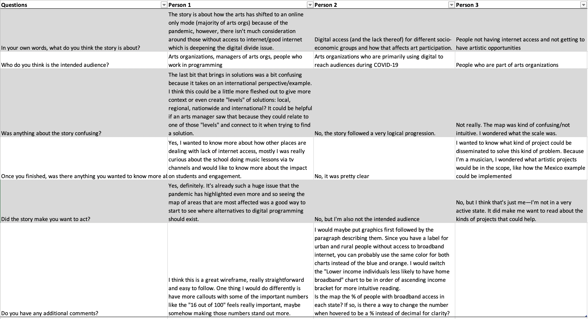

# Final Project Part 2: Storyboard and wireframes
Link to storyboard:[The Digital Divide's Impact on Arts Participation](https://preview.shorthand.com/dLt0DGBx5VIh0FkV)

# User research protocol
I have a fairly specific target audience for my story: arts administrators, especially those who are working in some capacity with adapting programming for the pandemic environment. Because of this, I wanted to interview people for my research who are in that target audience, or at least understood the considerations involved in that type of role. I also know that the programming museums have to adapt to the pandemic world is very different from performing arts programming, so I wanted to get representatives from both of these areas. Several of the examples in my project are also related to education, so I wanted to find at least one person with knowledge in that area.

The subjects I ended up with were:
1. Woman in her 20s in the arts management field who works in the visual arts sector and has a background in museums
2. Woman in her 20s with a background in performing arts who is in the arts management field and currently interns for a visual arts-based education nonprofit
3. Man in his 30s who is a musician and teaching artist

## Inteview script

**Intro:** My goal today is to get feedback on a data-based web story I'm creating. I’m talking to people to see what makes sense and what’s confusing. I'm still working on the design elements, but the general outline of the story and visualizations are there. All feedback is anonymous, and the total process should take less than 15 minutes of your time. I've sent you a link to the story if you want to open it and scan through it. 

**Questions:** 
- In your own words, what do you think this story is about?
- Who do you think is the intended audience?
- Was anything about the story confusing?
- Once you finished, was there anything you wanted to know more about?
- Did the story make you want to act?
- Do you have any additional comments? 

**Wrap-up:** Thank you for your time! Do you have any questions about the project for me? 

## Findings
Going into this, I think I had gotten too much in my head about the story making sense and following a logical progression. But, most of the feedback had to do wth the examples I used at the end of the story to demonstrate alternatives for online content. Other feedback included the way I ordered data vizualizations and the paragraphs relating to them.

Related to specifics about my data visualizations, feedback indicated that a few needed revisions for colors and labeling. Whenever we did peer reviews in class, I got some comments on my map visualization being a bit confusing because of the key and the fact that it automatically zoomed to Iceland on the page. I made a few adjustments before including it in my storyboard, but a couple of my subjects still had questions about the scale and labels on the key since the values are in decimals instead of percentages.

My interviewees were conflicted on whether or not the story made them want to act.

## Going forward
From this feedback, I am going to make the following adjustments:
1. Give more specific examples and strategies for implementing safe, offline artistic experiences. I will also think of ways I can use visualizations, maybe using Infogram, to convey these.
2. Clean up the vizualizations I do have based on feedback. The map of rural residents with broadband access seems to be a common point of confusion, so I am going to rethink if that is working or if it just needs more edits.
3. Enhance design and organization. Within the feedback, someone recommended emphasizing important numbers with text formatting, which I plan on doing. I am also going to rethink where I put the paragraphs of description based on the feedback to put visualizations first followed by the paragraph describing them. 

