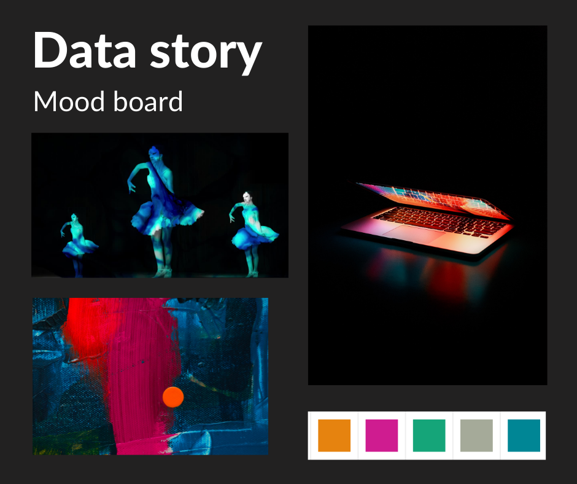

# Final Project Part 3: Final Story and Revisions

**Link to final Shorthand story:** [The Digital Divide's Impact on Arts Participation](https://carnegiemellon.shorthandstories.com/the-digital-divide-impact-on-arts-participation/index.html)

## Audience
The audience for my story is people in the arts management sector who have some control over the organization's programming. This audience spans artistic disciplines: performing arts, museums, arts education organizations, etc. 

As an arts management student who interned with an state arts advocacy organization over the summer, I know that many leaders in this sector have been struggling to find the resources—both time and money—to continue programming during the pandemic. By nature of the Covid-19 crisis, organizations had to adapt suddenly. Now that we are nine months into the pandemic and organizations may have a better handle on their pandemic programming, I thought that arts leaders could have some capacity to consider how their programming adaptations have affected accessibility. Arts organizations care about their content reaching communities—an Americans for the Arts survey found that 89% of organizations have been continuing to deliver artistic content during the pandemic for the purpose of raising community spirits and morale. 

To better connect with this audience, in my final story, I made sure to address *how* the digital divide impacts the arts sector and *why* this is important for arts leaders to consider. I also provided example solutions they could connect to.  

## Final revisions

From user feedback and before publishing my final story, the main changes I made were making some of the charts more understandable, fleshing out the solutions section, and making a more engaging call to action. The first visualization I revised was the unit chart that originally compared the number of people out of 100 that would lack broadband internet access in rural vs. urban areas. From feedback in class, I realized that introducing the divide that early would be confusing, and I wanted to find a context that would be relevant to arts organizations. I chose to visualize how many people in the Kennedy Center, a national performing arts venue, wouldn't have broadband internet access if all the seats were full with average U.S. residents. 

For the map visualization, I made the key and each state's labeling more clear. I also made sure that the map was "stuck" in the postion I wanted. 

One of my interviewees suggested segmenting the possible solutions so that arts leaders viewing my story could find a solution relevant to them. I did this by dividing the example solutions I found into local, regional, national, reservation-based, and international. Following this list of sample solutions, I tried to make a clearer, more motivating call to action for arts managers since a couple of the people I interviewed were not motivated to act. I also made a second call to action for people who may have found the story but do not work in the arts sector. 

Although this was not specifically mentioned in feedback, I wanted my story to be more visually unified so I selected a color scheme and used images that fit my theme. I also unified the font used on the visualizations and throughout the story. I used a mood board (shown below) to help me make those decisions.

**[Final Project: Part 1](/final-project.md)**  
**[Final Project: Part 2](/final-project2.md)** 

